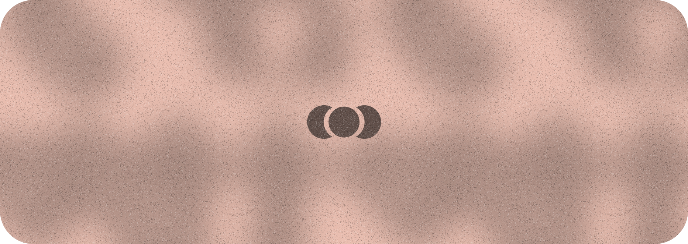

 

 <a href="https://gxbs.dev">
<picture>
  <source media="(prefers-color-scheme: dark)" srcset="cover-dark.png">
  <source media="(prefers-color-scheme: light)" srcset="cover-light.png">
  
</picture>
 </a>

    
 

